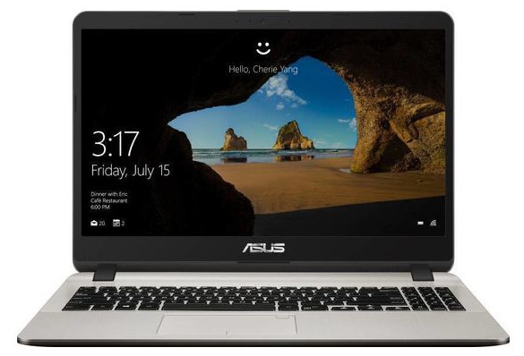
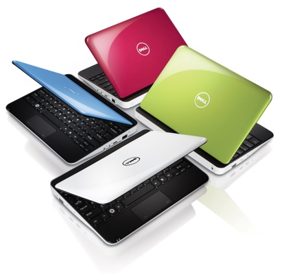
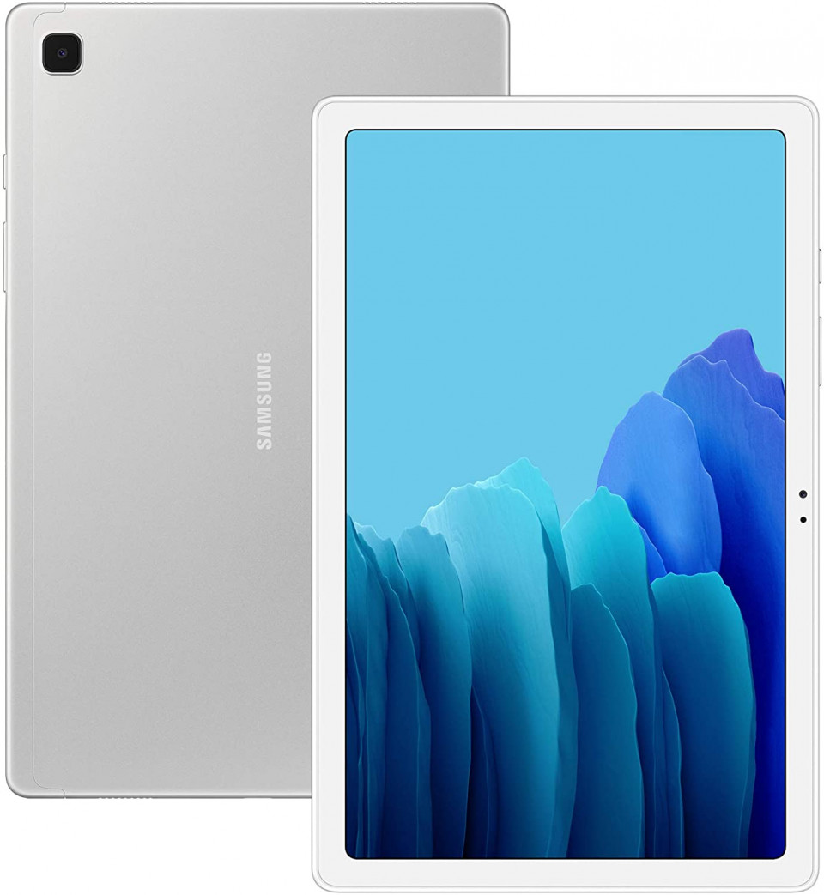

# კომპიუტერის ნაირსახეობანი

სიტყვა კომპიუტერი არის გამომთვლელი მანქანა, რომელიც არსებობს მრავალი სახით, კომპიუტერში ჩვენ ვგულისხმობთ პერსონალურ კომპიუტერს.

### სამაგიდე კომპიუტერი

პირველი პერსონალური კომპიუტერი იყო **სამაგიდე კომპიუტერი**, რომელსაც აქვს ოთხი ძირითადი მოწყობილობა:

1. პროცესორის ბლოკი: ყუთი, რომელშიც განთავსებულია სამაგიდე კომპიუტერის ძირითადი პროცესორი სხვა მოწყობილობებთან ერთად. ხშირად ამ ბლოკს უბრალოდ ვეძახით პროცესორს
2. ეკრანი, ასევე დისპლეი, რომელიც წარმოადგენს ინფორმაციის გამოტანის ძირითად მოწყობილობას.
3. კლავიატურა - კომპიუტერში ინფორმაციის შეტანის მოწყობილობა.
4. მანიპულიატორი თაგვი - რომელიც ასევე მიეკუთვნება ინფორმაციის შეტანის მოწყობილობებს.

სამაგიდე კომპიუტერი გამოიყენება სტაციონარული სამუშაოებისათვის მაგიდაზე, მისი მობილური გამოყენება მოუხერხებელიცაა და შეუძლებელიც.

### ნოუთბუკი

სახელი ნოუთბუკი გამოიყენება მსუბუქი პორტატიული კომპიუტერის აღსანიშნავად, რომელსაც აქვს დასაკეცი ფორმფაქტორი ჩაშენებული დისპლეით და კლავიატურით.

ნოუთბუკები შედარებით თხელია, მსუბუქი და ენერგიის მოხმარების კუთხით ეკონომიური, რის გამოც მას ბატარეა 5 და მეტი საათის განმავლობაში ამუშავებს. ნოუთბუკების გრაფიკული სისტემა შედარებით მარტივია, რადგან ასეთი მოწყობილობების დანიშნულებაა  მომხმარებლისათვის საბაზო კომპიუტერული შესაძლებლობების უზრუნველყოფა ოფისში ან სახლში.

ნოუთბუკების ეკრანის ზომა 12-14 დიუმია. ყველაზე პოპულარულია ნოუთბუკები 14 დიუმიანი ეკრანით. უმეტეს შემთხვევაში ნოუთბუკები აღჭურვილია საკომუნიკაციო საშუალებებით ინტერნეტში ჩასართველად. ცოტა ადრე, ასეთი საბაზო მოწყობილობა იყო ჩაშენებული მოდემი, თანამედროვე ნოუთბუკებში ამ ფუნქციას  Wi-Fi ადაპტერიც ასრულებს, თუმცა ნოუთბუკში შეიძლება შეგვხდეს მოწყობილობა მობილური ინტერნეტის უზრუნველსაყოფად SIM ბარათის მეშვეობით.

ნოუთბუკის პროცესორი ენერგო მოხმარების კუთხით ეკონომიურია რაც ბატარეის ხანგრძლივ მუშაობას უწყობს ხელს.

ნოუთბუკის ფასი უმეტესად არის მაღალი, რადგან ის პორტატიული და მინიმალისტურია.

### ლეპტოპი

ლეპტოპის სახელი მოდის ინგლისურიდან და აღნიშნავს პორტატიულ კომპიუტერს, რომლის განთავსებაც შესაძლებელია მუხლებზე \(lap - მუხლი\).

ლეპტოპის ეკრანი 15 დიუმი და მეტია, გრაფიკა - ძლიერი \(NVidia ან Ati Radeon-ის დაფები\)

კლავიატურა დიდი და განიერი აქვს, ციფრული კლავიატურა გატანილია გვერძე, ისე როგორს სამაგიდე კომპიუტერის სტანდარტულ კლავიატურაზე.

როგორც წესი, ლეპტოპებს ყოველთვის აქვს Bluetooth და WiFi, ასევე კომპაქტ დისკის ჩასადები და ხარისხიანი დინამიკები.

ლეპტოპში გათვალისწინებულია მაკომპლექტებლების განახლების შესაძლებლობა, გრაფიკის, მეხსიერების და სხვა კომპონენტების.

ლეპტოპებზე გვხდება Intel Centrino-ს პროცესორები, რომლის მახასიათებელი ენერგიის დაბალი მოხმარებაა, თუმცა ლეპტოპის ავტონომიურ რეჟმიში მუშაობა 3 საათის განმავლობაში ითვლება უკვე ნორმალურად.

უნდა ავღნიშნოთ, რომ ბევრ ლექსიკონში, ურთიერთობაში ნოუბუკი და ლეპტოპი აღიქმება სინონიმებად. მათ ხშირად არც კომპიუტერული მაღაზიები განასხვავებენ, მაგრამ როგორც ვხედავთ მათ შორის განსხვავება მაინც არსებობს და ეს უნდა გავითვალიწინოთ მათი შეძენისას, მით უფრო ევროპული ან ამერიკულ საიტებზე შეკვეთისას, რადგან გამყიდველმა წესით უნდა გააკეთოს განსხვავება ზემოთ აღნიშნული თვისებებიდან გამომდინარე.

ლეპტოპი ითვლება სამაგიდე კომპიუტერის პრაქტიკულად სრუფასოვან შემცვლელად, მაშინ როდესაც ნოუთბუკი არის მსუბუქი კომპიუტერი მოგზაურობისათვის და გარეთ მარტივი ამოცანების შესასრულებლად.

თანამედროვე ბაზრის პირობებში ლეპტოპსა და ნოუთბუკს შორის განსახვავება სულ უფრო მცირდება. ასევე ამ დასახელებას მნიშვნელობა აქვს უფრო ინგლისურ ენოვანი საზოგადოებისთვის, რომლებიც როგორც წესი არ აზუსტებენ ტექნიკურ მახასიათებლებს სახელიდან გამომდინარე, ჩვენ კი, ორივე ტიპს ერთი და იგივე სახელით მოვიხსენიებთ.

### ნეთბუკი

ნეთბუკი უნდა აღვიქვათ ნოუბუკად 12 დიუმიან ეკრანამდე. სხვა შესაძლებლობებით თანამედროვე ნებუკი უტოლდება ნოუბუკს, უბრალოდ მისი მეშვეობით მოხერხებულია ქუჩაში, ტრანსპორტში თუ კაფეში ისეთი საუცრათევო ამოცანების შესრულება, როგორიცაა ფოსტის შემოწმება, სასწრაფოდ შეტყობინების გაგზავნა და ა. შ.

ნეთბუკები გაბარიტებით საკმაოდ თხელია და შესაძლებელია მისი მოთავსება მცირე ჩანთაში სხვა ნივთებთან ერთად.

ყველაზე პოპულარულია ნეთბუკები 10 დიუმიანი ეკრანით.

### პლანშეტი

პლანშეტი არის პლანშეტის ფორმის მობილური კომპიუტერი. ნოუთბუკიდან მას განასხვავებს ძირითადად შიგთავსი.

უმეტესობა პლანშეტებს შეუძლიათ განახორციელონ მობილური ზარები

